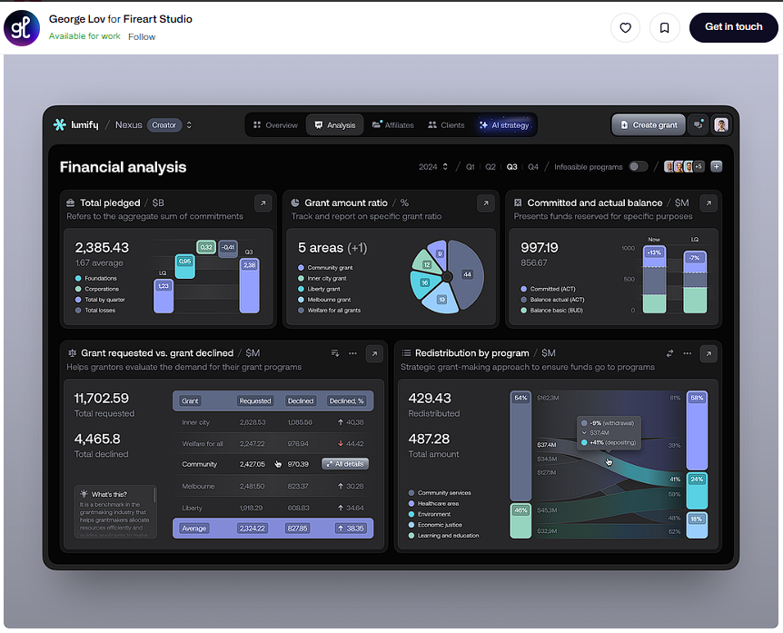

# Grant Tracking - VueJS UI Demo


Grant Tracking is a demo user interface project built with Vue.js, inspired by designs on Dribbble. This project showcases the ability to create beautiful and responsive user interfaces using Vue.js.

## UI by SokStudio



## Screenshots

Under development...

## Live Demo

You can view a live demo of the project here: [Live Demo](https://grant-tracking-vue-js-dribble-ui-demo.vercel.app/)

## Installation

1. Ensure you have Node.js and npm installed on your computer.
2. Clone this repository:

   ```bash
   git clone https://github.com/TilarnaExdilika/Grant-tracking---VueJS-Dribble-UI-Demo
   ```

3. Navigate to the project directory:

   ```bash
   cd Grant-tracking-VueJS-Dribble-UI-Demo
   ```

4. Install dependencies:

   ```bash
   npm install
   ```

5. Run the application:

   ```bash
   npm run dev
   ```

## Project Structure

The project is organized as follows:

```bash
grant-tracking/
├── src/
│   ├── assets/
│   │   ├── images/
│   │   └── styles/
│   ├── components/
│   │   ├── common/
│   │   ├── features/
│   │   └── layout/
│   ├── config/
│   ├── data/
│   ├── stores/
│   ├── types/
│   ├── views/
│   └── main.ts
├── public/
│   └── index.html
├── package.json
├── tsconfig.json
└── vite.config.ts
```

## Dependencies

The project uses the following packages:

- vue
- vue-router
- pinia
- @fortawesome/fontawesome-free
- typescript
- vite
- eslint
- prettier

## Contact

If you have any questions or suggestions, please reach out:

[](https://github.com/TilarnaExedilica) GitHub: TilarnaExedilica

[](https://www.facebook.com/IShino.Avery/) Phạm Anh

---

Thank you for your interest in this project!
